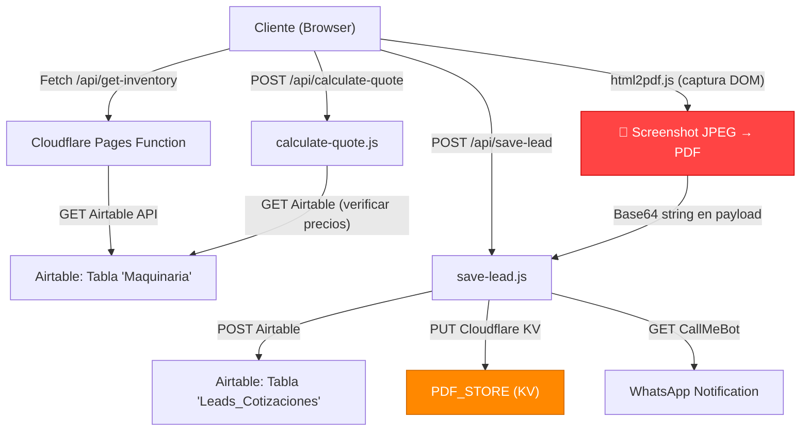
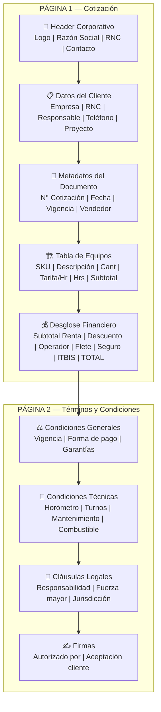
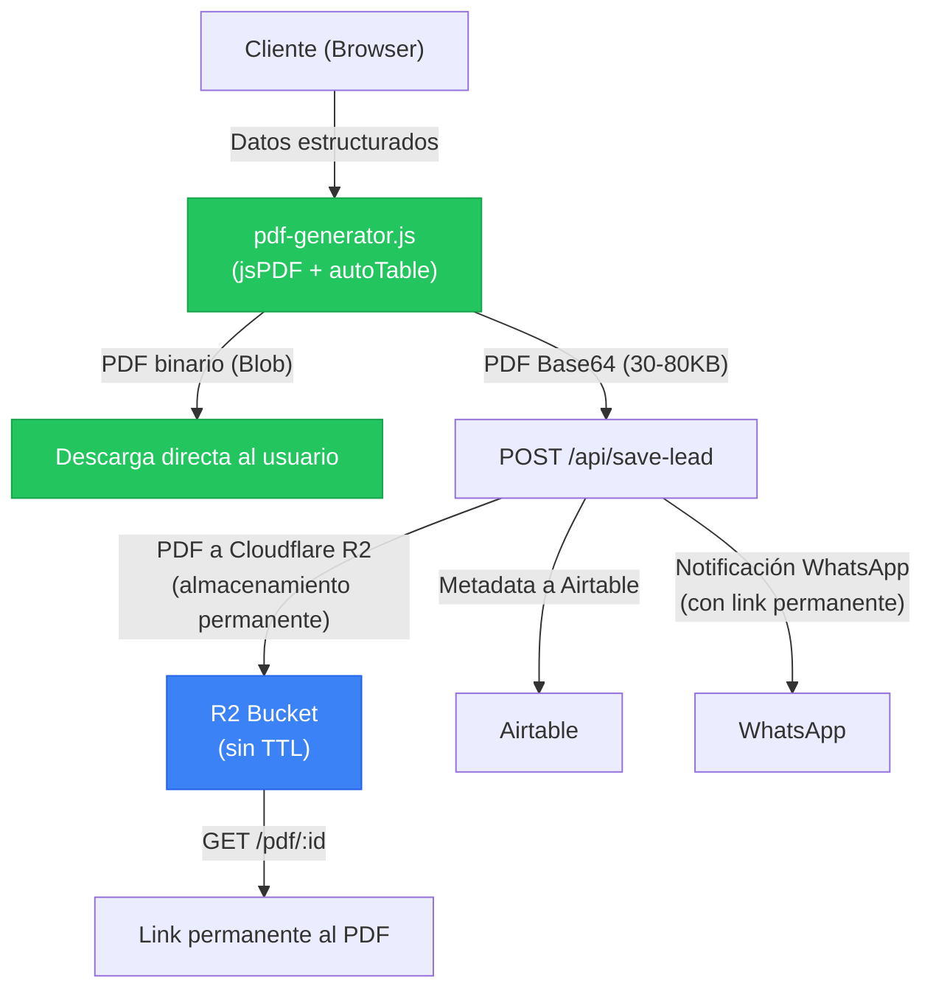
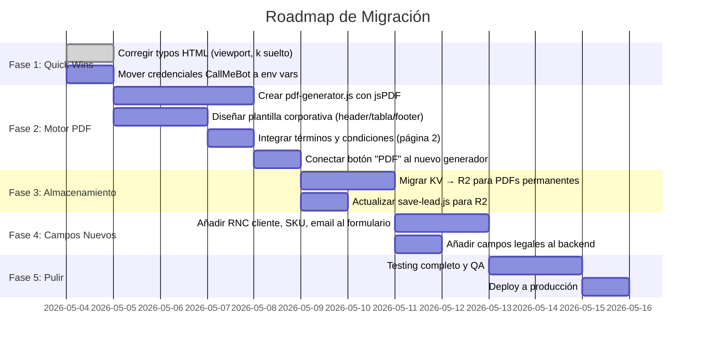

# 🏗️ COTIZADOR-V13: Auditoría de Sistema y Arquitectura de Solución

> **Documento técnico para la transformación del cotizador de maquinaria pesada**
> Preparado: Mayo 2026 | Versión actual del sistema: V13

---

## PARTE 1 — Auditoría Técnica del Sistema Actual

### 1.1 Arquitectura Actual (Mapa del Sistema)



### 1.2 Hallazgos Críticos

| # | Problema | Severidad | Archivo |
|---|----------|-----------|---------|
| 1 | **PDF es una captura de pantalla** (html2pdf.js = html2canvas → imagen JPEG → envuelto en PDF) | 🔴 Crítico | [script.js](file:///c:/Users/User%20Name/Desktop/COTIZADOR-V13/public/script.js#L509-L539) |
| 2 | **PDF enviado como Base64 en el body del POST** (~2-5MB como string en JSON payload) | 🔴 Crítico | [script.js](file:///c:/Users/User%20Name/Desktop/COTIZADOR-V13/public/script.js#L568) |
| 3 | **KV con TTL de 10 minutos** — el PDF desaparece y el link se rompe permanentemente | 🟠 Alto | [save-lead.js](file:///c:/Users/User%20Name/Desktop/COTIZADOR-V13/functions/api/save-lead.js#L78-L81) |
| 4 | **Credenciales hardcodeadas** (CallMeBot API key y teléfono en código fuente) | 🟠 Alto | [save-lead.js](file:///c:/Users/User%20Name/Desktop/COTIZADOR-V13/functions/api/save-lead.js#L41-L42) |
| 5 | **Doble cálculo** — lógica de días duplicada en frontend y backend | 🟡 Medio | [script.js:246](file:///c:/Users/User%20Name/Desktop/COTIZADOR-V13/public/script.js#L246-L259) vs [calculate-quote.js:159](file:///c:/Users/User%20Name/Desktop/COTIZADOR-V13/functions/calculate-quote.js#L159-L171) |
| 6 | **Typo en HTML** — `widc1th=device-width` en viewport meta | 🟡 Medio | [index.html:6](file:///c:/Users/User%20Name/Desktop/COTIZADOR-V13/public/index.html#L6) |
| 7 | **Carácter suelto `k`** en línea 16 del HTML | 🟡 Medio | [index.html:16](file:///c:/Users/User%20Name/Desktop/COTIZADOR-V13/public/index.html#L16) |
| 8 | **`generarPDF()` solo llama `window.print()`** — no genera archivo real | 🟠 Alto | [script.js:465](file:///c:/Users/User%20Name/Desktop/COTIZADOR-V13/public/script.js#L465) |
| 9 | **Sin paginación en Airtable** — fetch trae máximo 100 registros | 🟡 Medio | [get-inventory.js:14](file:///c:/Users/User%20Name/Desktop/COTIZADOR-V13/functions/api/get-inventory.js#L14) |

### 1.3 ¿Por Qué la Generación de PDF Actual es Técnicamente Inviable?

```
FLUJO ACTUAL (html2pdf.js):
┌─────────────┐    ┌──────────────┐    ┌──────────────┐    ┌─────────────┐
│  DOM HTML    │───▶│ html2canvas  │───▶│ Imagen JPEG  │───▶│ jsPDF wrap  │
│  (Step-2)   │    │ (rasteriza)  │    │ (0.98 quality)│    │ (como foto) │
└─────────────┘    └──────────────┘    └──────────────┘    └─────────────┘
                                                                  │
                                                           ┌──────▼──────┐
                                                           │ Base64 str  │
                                                           │ (~3-5 MB)   │
                                                           └──────┬──────┘
                                                                  │
                                                           ┌──────▼──────┐
                                                           │ JSON POST   │
                                                           │ body        │
                                                           └──────┬──────┘
                                                                  │
                                                           ┌──────▼──────┐
                                                           │ KV Store    │
                                                           │ (10 min TTL)│
                                                           └─────────────┘
```

**Consecuencias directas:**

1. **El PDF no es un documento** — Es una foto envuelta. No puedes seleccionar texto, copiar montos, ni hacer búsqueda (Ctrl+F). Cualquier auditor o ingeniero que reciba esto no puede extraer datos.

2. **No es indexable** — Google, sistemas ERP y cualquier software de gestión documental no puede leer el contenido. El PDF es opaco.

3. **Peso desproporcionado** — Un PDF con datos tabulares debería pesar 30-80KB. Tu captura pesa 3-5MB (60x más pesado).

4. **Renderizado inconsistente** — `html2canvas` no soporta CSS Grid/Flexbox al 100%. Los dark mode colors, Tailwind classes dinámicas y custom fonts pueden romperse en la captura. 

5. **El Base64 en el JSON body** puede exceder los límites de Cloudflare Workers (100MB request body, pero el parsing del JSON consume memoria del worker).

6. **El KV con 10 min TTL** significa que el link que mandas por WhatsApp deja de funcionar antes de que el cliente pueda abrirlo si está en una reunión.

> [!CAUTION]
> **Impacto comercial directo:** Si un ingeniero residente recibe un PDF que no puede copiar/pegar en su reporte de obra, o que se ve pixelado al imprimir en carta, tu cotización pierde credibilidad frente a un competidor que envía un documento profesional.

---

## PARTE 2 — Análisis del Nicho: Alquiler de Maquinaria Pesada

### 2.1 Estándares de la Industria

Las empresas de renta de maquinaria pesada en Latinoamérica y República Dominicana operan bajo un modelo B2B con las siguientes convenciones:

#### Tiempos de Entrega
| Concepto | Estándar |
|----------|----------|
| Tiempo de respuesta a solicitud de cotización | 2-4 horas laborables (urgente) / 24h (normal) |
| Movilización urbana | 24-48 horas después de firma de contrato |
| Movilización foránea | 48-72 horas (incluye coordinación de lowboy) |
| Desmontaje y retiro | 24-48 horas tras notificación de fin de obra |

#### Depósitos de Garantía
| Tipo | Monto Típico | Condición |
|------|-------------|-----------|
| Depósito de fiel cumplimiento | 15-25% del valor total del contrato | Reembolsable al cierre |
| Pagaré notarial | 100% del valor de reposición de la máquina | Obligatorio en DR |
| Primer mes / semana adelantado | 100% del período mínimo de renta | No reembolsable |
| Fianza de daños | $500-$2,000 USD fijo por equipo | Según valor de la máquina |

#### Seguros
| Póliza | Cobertura | Prima Típica |
|--------|-----------|--------------|
| Responsabilidad Civil (RC) | Daños a terceros en obra | 3-5% del subtotal |
| Seguro de maquinaria (Todo Riesgo) | Volcaduras, incendio, robo | 6-10% del subtotal |
| Deducible estándar | Primer 8-15% del siniestro lo asume el arrendatario | N/A |
| Seguro de transporte | Daños durante movilización | Incluido en flete o 2% adicional |

> [!NOTE]
> Tu sistema actual cobra 8% sobre renta pura por seguro, lo cual está **dentro del rango estándar** para una póliza combinada RC + Daños, pero debes especificar el tipo de cobertura y el deducible en la cotización.

### 2.2 ¿Es Viable una Cotización Previa Automatizada?

**Sí, es viable y cada vez más estándar.** Análisis:

| Factor | Valoración | Detalle |
|--------|-----------|---------|
| **Velocidad comercial** | ✅ Alta viabilidad | El 78% de contratos B2B los cierra quien responde primero. Una cotización en 3 minutos vs. 24 horas es ventaja competitiva brutal. |
| **Precisión de precios** | ⚠️ Con disclaimers | Los precios de flete fluctúan con el combustible. Solución: incluir cláusula "Precios referenciales sujetos a confirmación al momento de movilización". |
| **Variables de uso** | ✅ Manejable | Horómetro, turnos y combustible son variables conocidas. Tu sistema ya las maneja correctamente. |
| **Mantenimiento preventivo** | ✅ Tu sistema lo detecta | Tu alerta de >250 hrs es correcta. Estándar: PM cada 250-500 hrs según fabricante. |
| **Percepción profesional** | ✅ Muy positiva | Constructoras grandes valoran proveedores digitalizados. Una cotización PDF profesional instantánea señala organización. |

> [!IMPORTANT]
> **La cotización previa NO es un contrato.** Debe indicarse explícitamente como "PRESUPUESTO REFERENCIAL" con vigencia de 7-15 días. Esto te protege legalmente de fluctuaciones en flete y combustible.

### 2.3 Elementos Legales y Técnicos Obligatorios

Estos campos **deben** aparecer en toda cotización profesional de maquinaria pesada:

#### Datos Técnicos de la Máquina
- [x] Marca, modelo y año (ya lo tienes parcialmente)
- [ ] **Número de serie** — Identificador único del activo
- [ ] **Lectura de horómetro actual** — Estado de uso al momento de entrega
- [ ] **Estado mecánico general** — "Operativa" / "Requiere revisión"
- [ ] **Capacidad / Especificaciones** — Peso operativo, alcance, profundidad de excavación

#### Cláusulas Legales Mínimas
- [x] Vigencia de la cotización (tienes 15 días — correcto)
- [x] Requisito de depósito y pagaré (lo mencionas en condiciones)
- [ ] **Responsabilidad por daños** — Quién asume reparaciones por mal uso
- [ ] **Horas mínimas de cobro** — Aunque la máquina esté parada, se cobra mínimo X horas
- [ ] **Penalización por horas extra** — Si exceden el turno contratado
- [ ] **Condiciones de terreno** — "El cliente garantiza acceso adecuado para la máquina"
- [ ] **Cláusula de fuerza mayor** — Lluvias, huelgas, etc.
- [ ] **Jurisdicción y ley aplicable** — Tribunales competentes

#### Logística Obligatoria
- [x] Costo de movilización/desmovilización (lo tienes)
- [ ] **Tipo de transporte requerido** — Lowboy, cama baja, plataforma
- [ ] **Peso de transporte** — Para permisos de tránsito
- [ ] **Horario de entrega** — Algunas zonas restringen tránsito pesado nocturno

---

## PARTE 3 — Diseño de la Plantilla de Cotización Profesional

### 3.1 Estructura del Documento PDF



### 3.2 Campos de Datos Dinámicos

```
HEADER:
├── logo_url: string (URL del logo corporativo)
├── empresa_nombre: "Tu Marca Corporativo"
├── rnc: "RNC: XXX-XXXXXXX-X"
├── direccion: "Dirección fiscal"
├── telefono: "+1 (809) XXX-XXXX"
├── email: "cotizaciones@tumarca.com"
└── website: "www.tumarca.com"

DOCUMENTO:
├── quote_id: "QT-XXXXXX" (ya lo generas)
├── fecha_emision: Date
├── fecha_vigencia: Date (+15 días)
├── vendedor: string
└── version: number (para re-cotizaciones)

CLIENTE:
├── razon_social: string
├── rnc_cliente: string (NUEVO — necesario para facturación)
├── responsable: string
├── telefono: string
├── email_cliente: string (NUEVO)
├── proyecto: string
└── ubicacion: string

EQUIPOS[]:
├── sku: string (NUEVO — código interno del activo)
├── nombre: string
├── modelo: string
├── descripcion_corta: string
├── tarifa_hora: number
├── cantidad: number
├── fecha_ingreso: Date
├── fecha_retiro: Date
├── dias_laborables: number (calculado)
├── horas_totales: number (calculado)
└── subtotal_equipo: number (calculado)

LOGÍSTICA:
├── zona: "Urbana" | "Periferia" | "Foránea"
├── tipo_transporte: "Lowboy" | "Cama Baja" | "Plataforma"
├── costo_movilizacion: number
├── costo_desmovilizacion: number (puede diferir)
└── requiere_permiso_transito: boolean

DESGLOSE:
├── subtotal_renta_pura: number
├── descuento_pct: number
├── descuento_valor: number
├── costo_operador: number
├── costo_viaticos: number
├── costo_combustible: number
├── costo_flete: number
├── costo_seguro: number
├── subtotal_operativo: number
├── itbis_pct: 0.18
├── itbis_valor: number
└── total_presupuesto: number
```

### 3.3 Diseño Visual de la Plantilla

El PDF debe seguir estos principios:

| Aspecto | Especificación |
|---------|---------------|
| **Formato** | Carta (8.5" × 11") o A4 |
| **Tipografía** | Inter (consistente con tu web) — Headers: 700/800, Body: 400/500 |
| **Colores** | Primario: `#ea580c` (tu naranja actual), Negro: `#18181b`, Gris: `#71717a` |
| **Logo** | Esquina superior izquierda, max 150px ancho |
| **Tabla de equipos** | Headers con fondo `#18181b` texto blanco, filas alternadas gris claro |
| **Total** | Destacado con fondo naranja `#ea580c`, texto blanco, fuente 18pt bold |
| **Footer** | Número de página, "Documento generado electrónicamente" |
| **Marca de agua** | "COTIZACIÓN PREVIA — NO ES CONTRATO" semi-transparente (opcional) |

---

## PARTE 4 — Stack Tecnológico Recomendado

### 4.1 Comparativa de Opciones

| Tecnología | Tipo | Pros | Contras | Veredicto |
|------------|------|------|---------|-----------|
| **html2pdf.js** (actual) | Client-side, screenshot | Ya lo tienes integrado | No es un PDF real, es una foto | ❌ Eliminar |
| **jsPDF + autoTable** | Client-side, programático | Sin servidor, ligero (~200KB), texto real seleccionable | API imperativa (coordenadas X,Y), difícil layouts complejos | ✅ **Recomendado para tu caso** |
| **@react-pdf/renderer** | Client/Server, React | Sintaxis JSX, diseño declarativo, excelente tipografía | Requiere React, bundle más grande (~400KB) | ⚠️ Sobredimensionado sin React |
| **Puppeteer / Playwright** | Server-side, headless browser | Renderiza cualquier HTML/CSS perfectamente | Requiere Node.js server con 200MB+ RAM, no funciona en Cloudflare Workers | ❌ No compatible con tu infra |
| **PDFKit** | Server-side, programático | Muy potente, streams, bajo consumo | API de bajo nivel, Node.js only | ⚠️ Viable si migras a Node |
| **ReportLab** | Python server-side | Estándar de la industria en Python | Requiere backend Python, no tu stack | ❌ Stack incompatible |
| **pdf-lib** | Client/Server, JS | Muy ligero, modifica PDFs existentes, funciona en Workers | API de bajo nivel, sin soporte HTML | ⚠️ Complementario |

### 4.2 Recomendación Final: **jsPDF + jspdf-autotable** (Client-Side)

**¿Por qué esta elección?**

1. **Compatible con tu infraestructura actual** — No necesitas servidor adicional. Cloudflare Pages + Functions se mantiene.
2. **Genera PDFs reales** — Texto seleccionable, copiar/pegar, indexable, buscable.
3. **Peso liviano** — El PDF generado pesará 30-80KB vs. 3-5MB actual.
4. **Sin dependencias de servidor** — No hay cold starts, no hay timeouts, no hay costos de compute.
5. **Plantilla por código** — Defines la estructura una vez y los datos la llenan dinámicamente.

**Librerías exactas a instalar:**

```
jsPDF v2.5.x          → Motor de generación de PDF
jspdf-autotable v3.8.x → Plugin para tablas profesionales (automático)
```

**CDN para tu proyecto (sin build step):**
```html
<script src="https://cdnjs.cloudflare.com/ajax/libs/jspdf/2.5.2/jspdf.umd.min.js"></script>
<script src="https://cdnjs.cloudflare.com/ajax/libs/jspdf-autotable/3.8.4/jspdf.plugin.autotable.min.js"></script>
```

### 4.3 Arquitectura Propuesta (Post-Migración)



> [!TIP]
> **Mejora crítica**: Reemplaza Cloudflare KV (TTL 10 min) con **Cloudflare R2** (almacenamiento de objetos, permanente, gratis hasta 10GB). Así el link del PDF en WhatsApp funciona para siempre.

### 4.4 Roadmap de Implementación



---

## Resumen Ejecutivo

| Antes (V13) | Después (V14) |
|-------------|---------------|
| PDF = Captura de pantalla (JPEG) | PDF = Documento real con texto seleccionable |
| 3-5 MB por cotización | 30-80 KB por cotización |
| Link expira en 10 minutos | Link permanente (Cloudflare R2) |
| No se puede copiar/pegar datos | Texto indexable y buscable |
| Sin datos técnicos de máquina | SKU, horómetro, número de serie |
| Sin cláusulas legales formales | T&C completos en página 2 |
| Credenciales en código fuente | Variables de entorno seguras |
| `window.print()` como "PDF" | jsPDF generando documento real |

> [!IMPORTANT]
> **Siguiente paso recomendado:** Confirma si deseas que proceda con la **Fase 2** (crear el motor `pdf-generator.js` con la plantilla corporativa completa usando jsPDF). Puedo implementarlo directamente en tu proyecto actual sin romper nada existente.
